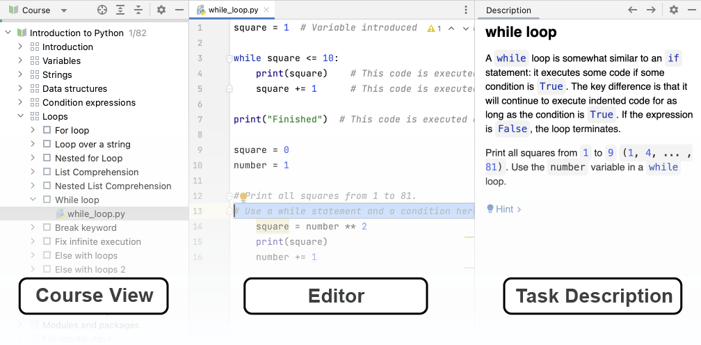

## JetBrains Academy plugin overview

This lesson will help you take your first steps with the [JetBrains Academy plugin](https://www.jetbrains.com/help/education/educational-products.html) and use it to learn Python.

With the JetBrains Academy plugin, you can learn programming languages and tools by completing coding tasks and get instant feedback right inside the IDE.

If you're already familiar with the interface, you can skip this lesson.

### Working with courses
When you open a course, you will see the main tool windows used for navigation: <b>Course View</b>, <b>Editor</b>, and <b>Task Description</b>. 

In <b>Course View</b>, you can switch between lessons and tasks. In the <b>Editor</b>, you write code and complete the task. In <b>Task Description</b>, you can read the theory and the task instructions.

### Task Description

The **Task Description** window gives you all the information you need to complete a task: 

- For theoretical tasks, the description provides learning and reading materials.
- For programming assignments, it states the problem to be solved. 

Use Task Description icons for the following actions:

| Icon                               | Description                   |
|------------------------------------|-------------------------------|
|**Check**                           | Check the correctness of your answer (for a quiz) or your code solution (for a programming task)|   
| **Run**                            | Run your code (for a theoretical task)|
|                | Go to the previous task       |    
| &nbsp;or **Next** | Go to the next task| 
|               | Discard all the changes you’ve made in the task, and start over|
|<a>Peek Solution...</a>             | Reveal the correct answer and show the <b>diff</b>|

