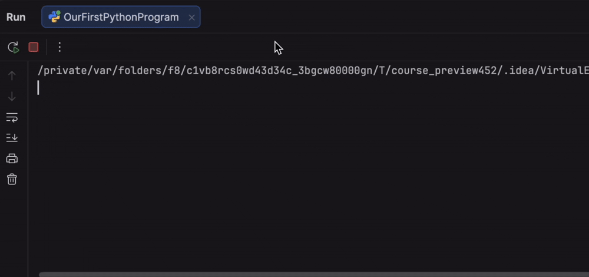

### Understanding the Code

```python
name = input("what is your name?\n")  # Gets input from you
print("Hello " + name)                 # Prints the greeting
```

- `input()` - Asks you to type something
- The Run tool window (at bottom) is where you type and see output
- `print()` - Shows messages on screen

**Try It!**

1. Click the **Run** button () at the top right
2. Type your name when asked
3. Press Enter
4. See your personalized greeting!



<style>
img {
  display: inline !important;
}
</style>