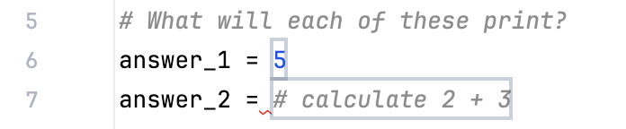

### Entering Multiple Answers

In future tasks, you may see several input fields for your answers. The highlighted box in the image below shows where you need to enter them.



In such cases, the test checks all fields together. If you enter some correct answers but leave the others empty, the test will not pass. **Make sure to fill in all answer fields before running the test.**

### Comments
In Python, comments start with the hash character (`#`) followed by a single space and extend to the end of the line. They are shown in gray in the editor and **do not affect how the program runs.**

```python
attempt += 1  # Count the number of login attempts
```
You can read more about proper commenting in <a href="https://www.python.org/dev/peps/pep-0008/#comments">PEP 8 – Style Guide for Python Code</a>.
