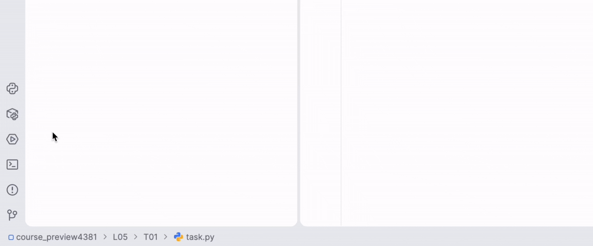

In this task, you build a simple guessing game. The program gets a range from the command line, generates a random number in that range, and keeps asking the user until they guess it.

### Command-line arguments and random numbers

#### `sys.argv`

Running this task may be a little less obvious than usual, because the program needs **command-line arguments**. To read command-line arguments, use the `sys` module:

```python
import sys
```

`sys.argv` is a list of strings:

- `sys.argv[0]` is the file name
- `sys.argv[1]` is the first argument
- `sys.argv[2]` is the second argument

For example, to run this task, open the Terminal in PyCharm using the button in the **bottom-left corner**, then run:

```bash
python L05/T01/task.py 3 7
````


What this command means:

* `python` starts the Python interpreter
* `L05/T01/task.py` is the path to the file you need to run
* `3` is the first command-line argument
* `7` is the second command-line argument

Why is the path `L05/T01/task.py`?

Because you run the command from the **course root folder**, and the file is inside **Lesson 05** (`L05`) and **Task 01** (`T01`). The file name is `task.py`.

So this command runs `task.py` and passes `3` and `7` to the program as the range.

```python
sys.argv[1]  # '3'
sys.argv[2]  # '7'
```

Please note that values in <code>sys.argv</code> are **strings**, so convert them with <code>int()</code> before using them as numbers.</div>

#### `randint()`

`randint(a, b)` returns a random integer from `a` to `b`, including both ends.

```python
from random import randint

ticket = randint(100, 105)
```

Here `ticket` can be 100, 101, 102, 103, 104, or 105.

#### Break and continue

- `break` stops the loop completely
- `continue` skips the current iteration and starts the next one

```python
if number == random_number:
    break
except ValueError:
    print("Please enter a number")
    continue
```

#### Range check

As a reminder, Python allows chained comparisons:

```python
1 <= x <= 10
```

So in this task, the check should confirm that the entered number is between the two command-line arguments.