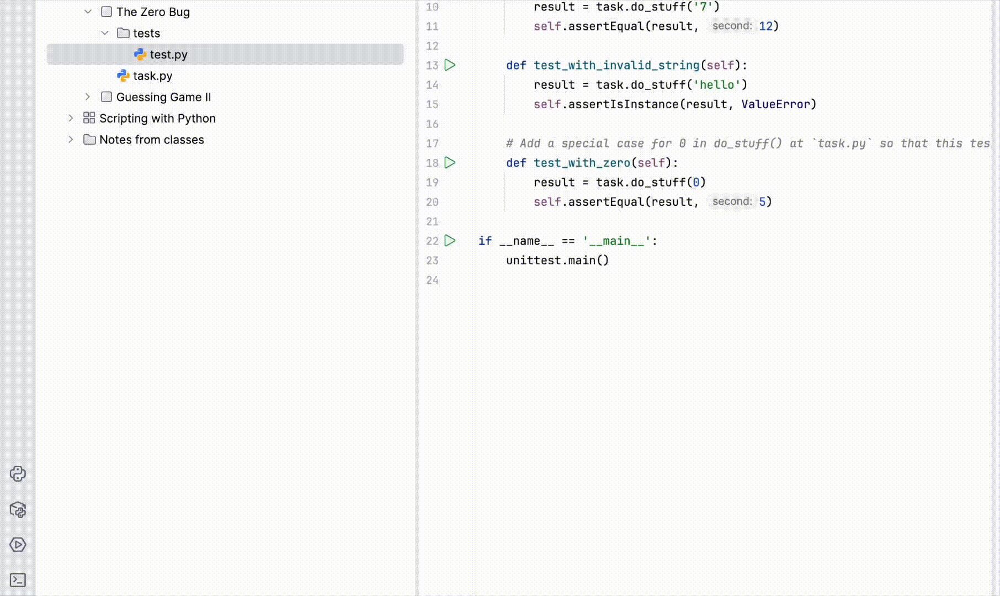

In this topic, you will work with automated tests written with Python’s built-in `unittest` module.

### Testing edge cases with unittest

To understand what your code is expected to do, first open the `tests/test.py` file in your project and look at the test methods there. Tests often show not only the main behavior of a function, but also the tricky cases that are easy to miss.

The `unittest` module lets us check whether a function returns the expected result for different inputs.

At `tests/test.py` file run the tests directly from the editor. Click the  icon to the left of a specific test method if you want to check just one case, or click the same icon next to `main` to run the whole test file at once. This way, you can quickly verify whether a single edge case passes or see how your solution behaves across all tests in the class.

<div style="text-align: center; width:100%; max-width: 800px;">
  
</div>

Another example:

```python
import unittest

def process_value(x):
    return x * 2

class TestExample(unittest.TestCase):
    def test_valid_value(self):
        result = process_value(3)
        self.assertEqual(result, 6)
```

This test calls a function and checks whether the returned value matches the expected one. In this case, the expected value is `3 * 2` and it's equal to `6`.

### What tests usually cover

A good test file checks several kinds of input:

* a normal valid value;
* an invalid value;
* a value of a different type;
* an edge case.

An **edge case** is a special input that is still valid, but easy to handle incorrectly.

Now return to `tests/test.py` and look at what the tests check. Notice that the last test fails. Try to understand why this input is a special case, and then update your function so that all tests pass.

<style>
img {
  display: inline !important;
}
</style>